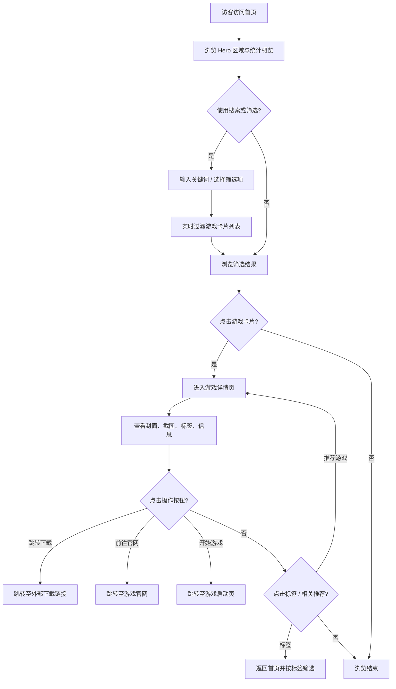

## 1. 产品概述

一个纯静态的 Game 游戏列表展示网站，通过构建时读取本地 JSON 文件中的游戏数据，预渲染生成静态页面，实现完全无后端的 Serverless 架构，可直接部署到 GitHub Pages / Cloudflare Pages / Vercel 等任意静态托管平台。

* **核心目标**：以优质视觉呈现游戏目录，支持分类浏览、搜索筛选与详情查看

* **目标用户**：Galgame / 视觉小说爱好者，希望快速浏览游戏信息与封面

* **核心价值**：零运维成本，一次构建即可部署，更新游戏仅需修改 JSON 文件后重新构建

## 2. 核心功能

### 2.1 用户角色

| 角色   | 说明                           |
| ---- | ---------------------------- |
| 访客用户 | 无需注册登录，直接浏览、搜索、筛选游戏列表，查看游戏详情 |

### 2.2 功能模块

1. **首页（游戏列表页）**：Hero 区域、统计概览、分类筛选、搜索、游戏卡片网格、分页加载
2. **游戏详情页**：封面大图（可点击跳转）、基本信息、操作按钮组（下载/官网/开始游戏）、截图画廊、标签展示、相关游戏推荐

### 2.3 页面详情

| 页面名称 | 模块名称    | 功能描述                        |
| ---- | ------- | --------------------------- |
| 首页   | Hero 区域 | 品牌标题、副标题、简洁介绍，营造沉浸式氛围       |
| 首页   | 统计概览    | 展示游戏总数、分类数、最近更新等概要数据        |
| 首页   | 搜索栏     | 支持按游戏名称、开发商模糊搜索，实时过滤结果      |
| 首页   | 分类筛选    | 按标签/类型/平台/年份等维度多选筛选项，支持快捷切换 |
| 首页   | 游戏卡片网格  | 以卡片网格展示游戏封面、标题、评分、标签，响应式布局  |
| 首页   | 分页/无限滚动 | 支持分页浏览或滚动加载更多游戏             |
| 详情页  | 封面与信息   | 大尺寸封面图（可配置点击跳转链接）、标题、开发商、发行日期、平台等核心元数据 |
| 详情页  | 操作按钮组   | 最多三种操作按钮：跳转下载、前往官网、开始游戏，根据 JSON 配置动态展示 |
| 详情页  | 截图画廊    | 游戏截图轮播或网格展示，支持点击放大预览        |
| 详情页  | 标签云     | 以标签云形式展示游戏类型、风格标签，支持点击跳转筛选  |
| 详情页  | 相关推荐    | 推荐同类或同开发商的游戏卡片列表            |

## 3. 核心流程



## 4. 数据结构（JSON）

```json
{
  "games": [
    {
      "id": "string",
      "title": "string",
      "titleZh": "string (可选中文标题)",
      "developer": "string",
      "publisher": "string",
      "releaseDate": "YYYY-MM-DD",
      "platform": ["PC", "Switch", "PS5", "Android", "iOS"],
      "rating": 0.0-10.0,
      "coverImage": "string (封面图片URL或本地路径)",
      "coverLink": "string (封面点击跳转链接, 可选, 为空则不可点击)",
      "screenshots": ["url1", "url2"],
      "tags": ["视觉小说", "恋爱", "科幻"],
      "description": "string (简短描述)",
      "buttons": [
        {
          "type": "download",
          "label": "跳转下载",
          "url": "https://example.com/download"
        },
        {
          "type": "website",
          "label": "前往官网",
          "url": "https://example.com"
        },
        {
          "type": "play",
          "label": "开始游戏",
          "url": "https://example.com/play"
        }
      ]
    }
  ],
  "lastUpdated": "ISO 日期字符串"
}
```

**字段说明**：

| 字段 | 类型 | 必填 | 说明 |
|------|------|------|------|
| `coverLink` | `string` | 否 | 封面图片的点击跳转链接，为空时封面不可点击 |
| `buttons` | `array` | 否 | 操作按钮列表，最多三个，类型不重复 |

**按钮类型定义**：

| type | 用途 | 典型样式 |
|------|------|----------|
| `download` | 跳转下载 | 跳转到外部下载页面（网盘、资源站等） |
| `website` | 前往官网 | 跳转到游戏官方网站 |
| `play` | 开始游戏 | 跳转到在线游玩页面或游戏启动入口 |

- `buttons` 数组可包含 0~3 个按钮，每个 `type` 最多出现一次
- 按钮按数组顺序渲染展示
- 所有按钮链接均为外部跳转（`target="_blank"`）

## 5. 非功能需求

* **性能**：Lighthouse 评分 > 90，首屏加载 < 2s

* **SEO**：预渲染静态 HTML，每个游戏详情页独立路由，支持 Open Graph 标签

* **可维护性**：更新游戏仅需修改 JSON 文件，重新构建即可部署

* **托管兼容**：纯静态输出，兼容 GitHub Pages / Cloudflare Pages / Vercel / Netlify

